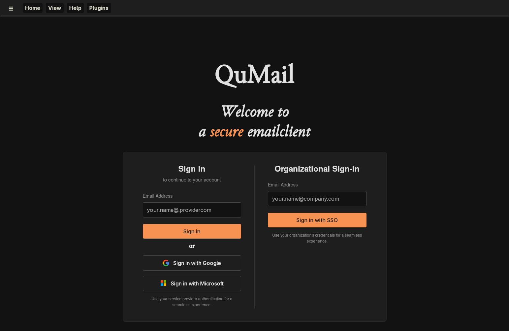
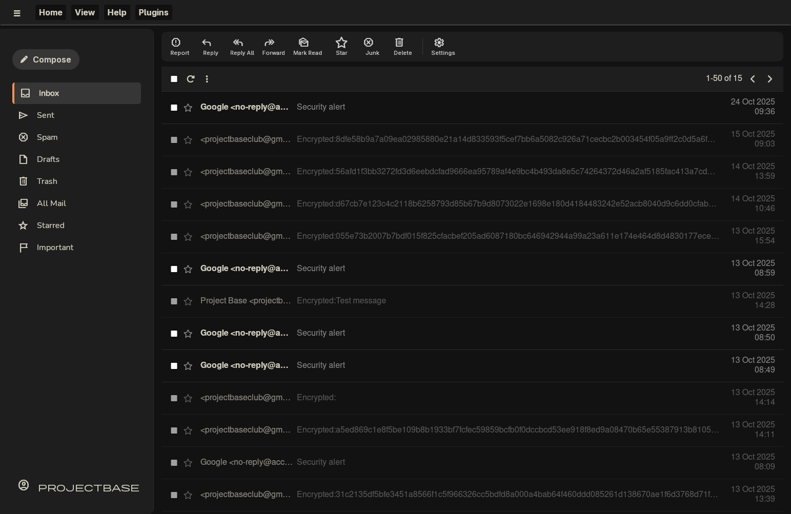
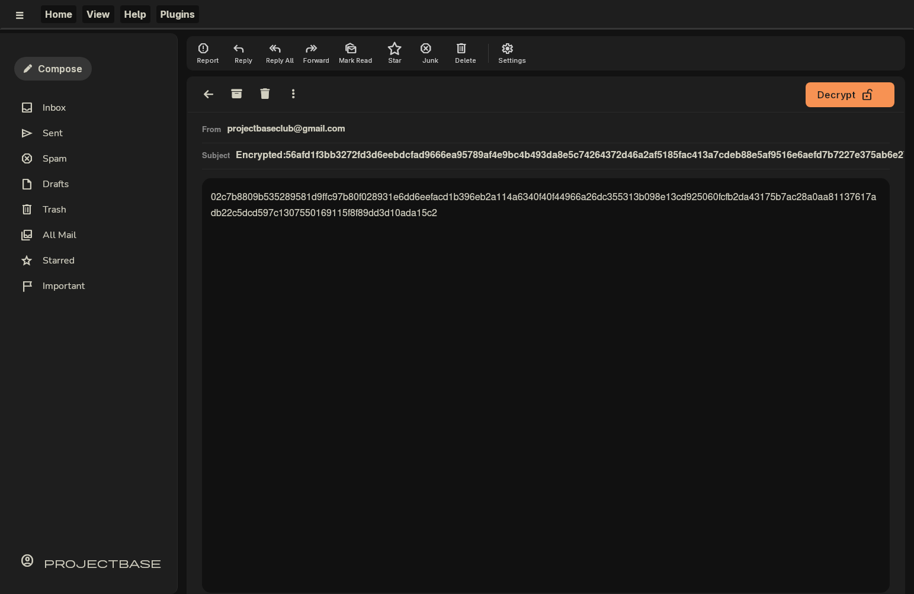
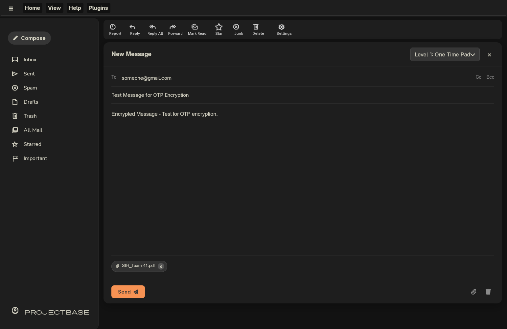

# QuMail - Quantum Secure Email Client

A quantum-secure email client application integrating Quantum Key Distribution (QKD) technology with existing email protocols to provide enhanced security for email communication in the post-quantum era.

**Smart India Hackathon 2025 Project**  
**Problem Statement ID:** 25179  
**Organization:** Indian Space Research Organisation (ISRO)

## Demo

Watch the prototype demonstration and project explanation: [YouTube Demo](https://www.youtube.com/watch?v=EzE-30P-6tg)

## Overview

QuMail addresses the vulnerability of conventional email encryption mechanisms to quantum computing threats by integrating Quantum Key Distribution (QKD) services with standard email protocols. The application provides unconditional security while maintaining compatibility with popular email service providers like Gmail and Yahoo Mail.

<p align="center">
    
    
</p>
<p align="center">
    
    
</p>

## Key Features

- **QKD Integration**: Interfaces with Key Manager (KM) for quantum key retrieval using ETSI GS QKD 014 protocol
- **Multi-Level Security Configuration**:
  - Level 1: Quantum Secure (One Time Pad)
  - Level 2: Quantum-aided AES (quantum keys as seed)
  - Level 3: Post-Quantum Cryptography options
  - Level 4: Standard encryption
- **Email Protocol Compatibility**: Works with existing email servers through standard protocols (SMTP, IMAP)
- **Application-Layer Encryption**: Encrypts email content and attachments before transmission
- **Modular Architecture**: Designed for easy upgradation and potential integration of additional communication features


## Architecture

QuMail is built using:
- **Framework**: Wails (Go + Web frontend)
- **Frontend**: Vue.js
- **Backend**: Go
- **Platform**: Cross-Platform

The application architecture follows a three-layer approach:
1. User interface layer (Vue.js GUI)
2. Application logic layer (Go backend)
3. Integration layer (KM and Email server interfaces)

## How It Works

1. Users authenticate with their Key Manager service and email provider
2. Local Key Managers at both sender and receiver ends maintain synchronized quantum keys
3. User composes email with optional attachments
4. Application retrieves quantum keys from KM via REST API (ETSI GS QKD 014)
5. Email content is encrypted at application layer using selected security level
6. Encrypted payload is sent through standard email infrastructure
7. Recipient's QuMail client decrypts using corresponding quantum keys from their KM

## Prerequisites

- Go 1.21 or higher
- Node.js 16 or higher
- Wails v2 installed

## Installation

1. Clone the repository:
```bash
git clone https://github.com/kshrs/qumail.git
cd qumail
```

2. Install Wails CLI (if not already installed):
```bash
go install github.com/wailsapp/wails/v2/cmd/wails@latest
```

3. Install frontend dependencies:
```bash
cd frontend
npm install
cd ..
```

4. Install Go dependencies:
```bash
go mod download
```

## Running the Application

### Development Mode

```bash
wails dev
```

This starts the application with hot-reload enabled for both frontend and backend changes.

### Production Build

```bash
wails build
```

The compiled executable will be available in the `build/bin` directory.

### Running the Built Application

After building, navigate to the build output directory and run:
```bash
.\build\bin\qumail.exe
```

## Configuration

For testing purposes, you can simulate the Key Manager service. Refer to ETSI GS QKD 014 specifications for KM simulation details.

Configuration files should include:
- KM service endpoint
- Email server credentials (SMTP/IMAP)
- Security level preferences

## Development Notes

The project structure follows Wails conventions:
- `/frontend` - Vue.js application
- `/` - Go backend code
- `/build` - Build outputs

The modular architecture allows for future expansion into a complete application suite with chat, audio, and video calling capabilities.

## Future Scope

- Integration of additional peer-to-peer communication features (chat, voice, video)
- Support for multiple Key Manager implementations
- Enhanced post-quantum cryptography algorithms

## References

- [ETSI GS QKD 014](https://www.etsi.org/deliver/etsi_gs/QKD/001_099/014/01.01.01_60/gs_qkd014v010101p.pdf) - QKD Protocol and Data Format
- [Smart India Hackathon Problem Statements](https://www.sih.gov.in/sih2025PS)

### Note
- The initial login is broken and currently working from a .env file
